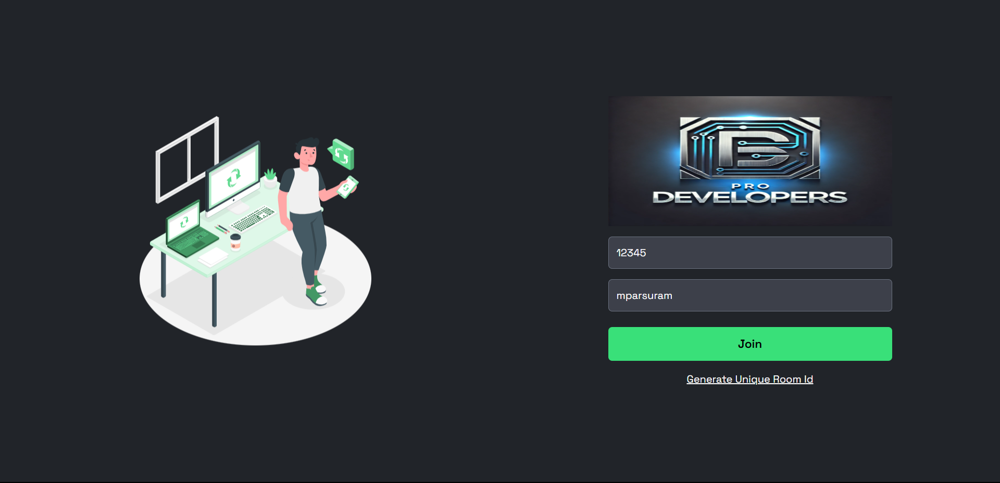
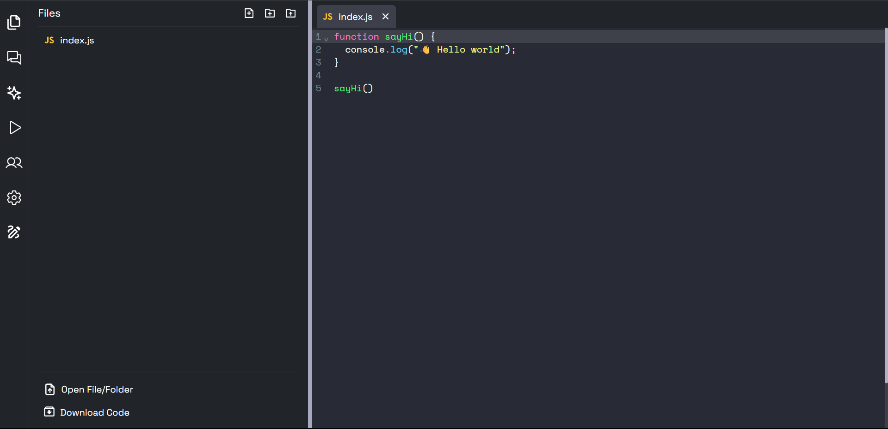
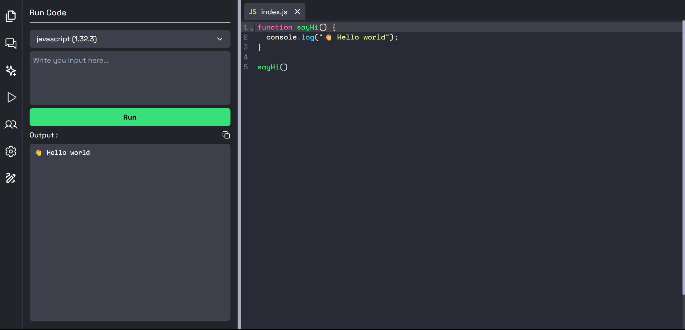

# 🧠 Cloud Compiler with Real-time Collaboration

A cloud-based code compiler that allows users to write, compile, and run code directly in the browser, with **real-time collaborative editing** — built using **React, TypeScript, Node.js, and Express.js**.

## 🚀 Features

- 👨‍💻 Real-time collaborative code editing
- ⚙️ Multi-language code execution (e.g., C++, Python, JavaScript)
- 💻 Monaco editor with syntax highlighting & autocompletion
- 🧪 Cloud-based secure code execution (via Docker or Judge0 API)
- 📡 WebSocket integration for live collaboration
- 🔒 Secure and scalable backend architecture

## 🛠️ Tech Stack

| Frontend            | Backend               | Real-time         | Execution Engine    |
|---------------------|------------------------|--------------------|---------------------|
| React, TypeScript   | Node.js, Express.js    | WebSocket, Socket.IO | Docker / Judge0 API |

## 📸 Screenshots

## 📸 Joining Room. 

## 📸 Live Code Editor.

## 📸 Code Execution.

## ⚙️ Getting Started

### Prerequisites

- Node.js 
- npm
- Docker
